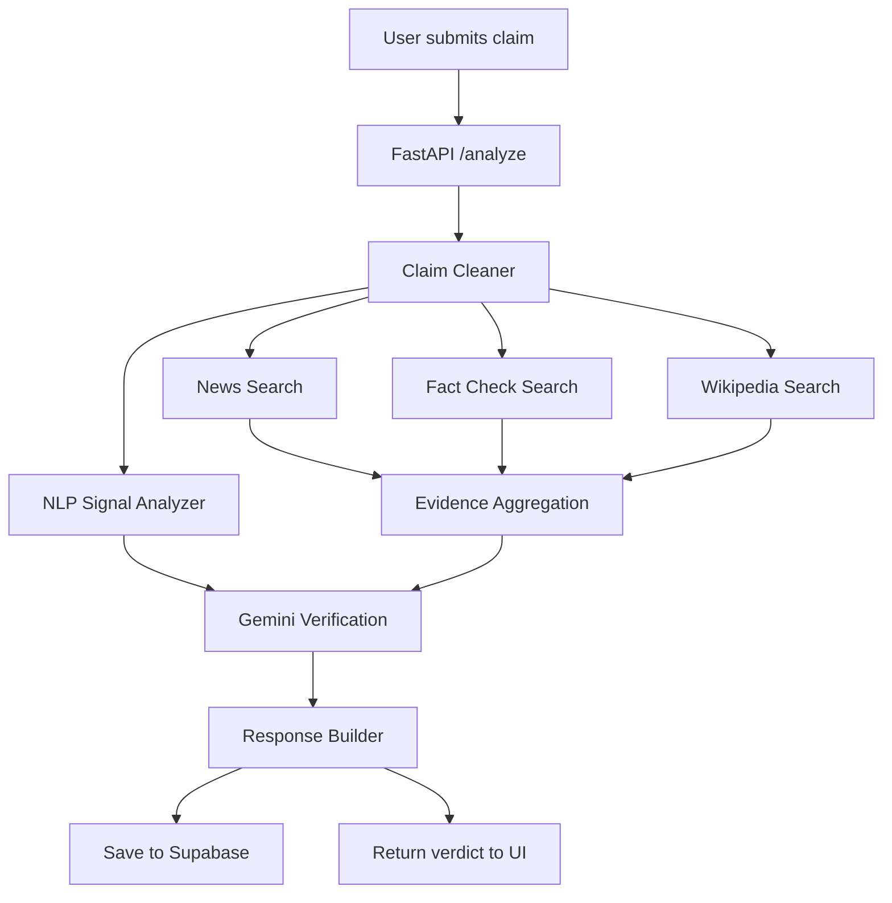

# TruthLens: AI-Powered Fake News Detection

**System Theme:** AI & Automation (Beyond Wrappers)  
**Team Leader:** Vishal Kumar Sahu  
**Team:** Deep Mind

TruthLens is a full-stack misinformation detection platform that analyzes suspicious claims using multi-source evidence, AI reasoning, and NLP red-flag detection. It provides a verdict (`VERIFIED`, `MISLEADING`, `FALSE`, or `UNVERIFIED`) with score, confidence, sources, and user-friendly summaries (including Hindi support).

## 1. What This Project Does

- Accepts a user claim from frontend UI.
- Cleans and normalizes the claim.
- Pulls evidence from:
  - Google Fact Check API
  - NewsAPI
  - Wikipedia API
- Runs NLP red-flag heuristics (caps, sensational language, chain-message patterns).
- Uses Gemini via LangChain for final structured reasoning.
- Saves analysis history in Supabase.
- Supports authentication, OTP verification, profile management, and account deletion flow.

## 2. Architecture and Workflow



### Core Pipeline (backend/agents/pipeline.py)
1. Claim preprocessing (`extract_and_clean_claim`)
2. NLP risk flag extraction (`analyze_nlp_signals`)
3. Parallel evidence retrieval (`asyncio.gather`)
4. Gemini verification on combined context
5. Final structured response build
6. Persist analysis to Supabase

## 3. Tech Stack

- **Frontend:** HTML, CSS, Vanilla JavaScript
- **Backend:** FastAPI, Uvicorn
- **AI Layer:** LangChain + Gemini (`langchain-google-genai`)
- **Data Layer:** Supabase (users, analyses)
- **Auth:** JWT + hashed passwords (Passlib)
- **Email:** SMTP OTP and report emails

## 4. Project Structure

```text
truthlens/
+-- backend/
|   +-- agents/             # claim pipeline + AI + source fetchers
|   +-- auth/               # auth routes + JWT/password utils
|   +-- database/           # supabase connection, models, CRUD
|   +-- utils/              # logger, email service
|   +-- main.py             # FastAPI app entry
|   +-- requirements.txt
|   +-- .env.example
+-- frontend/
|   +-- index.html
|   +-- components/
|   +-- css/
|   +-- js/
|   +-- pages/
+-- supabase_schema.sql
```

## 5. Local Setup and Run

### 5.1 Prerequisites

- Python 3.10+ (recommended 3.11+)
- Pip
- Supabase project
- API keys:
  - Google API key (Gemini + Fact Check API)
  - NewsAPI key
- Optional: SMTP credentials for live email delivery

### 5.2 Backend Setup

```bash
cd backend
python -m venv .venv
```

Windows (PowerShell):
```bash
.venv\Scripts\Activate.ps1
```

Install dependencies:
```bash
pip install -r requirements.txt
```

Create env file:
```bash
copy .env.example .env
```

Update `backend/.env` with your real values:

```env
NEWS_API_KEY=your_newsapi_key
GOOGLE_API_KEY=your_google_api_key
GEMINI_MODEL=gemini-1.5-flash

SUPABASE_URL=https://your-project.supabase.co
SUPABASE_KEY=your_supabase_anon_or_service_key

JWT_SECRET=generate_a_strong_secret
JWT_EXPIRE_HOURS=24

SMTP_SERVER=smtp.gmail.com
SMTP_PORT=587
SMTP_USER=your_email
SMTP_PASSWORD=your_app_password
```

Notes:
- If SMTP is not configured, emails are mocked in backend logs.
- If API keys are missing, analysis still returns fallback `UNVERIFIED` responses.

### 5.3 Supabase Setup

1. Open Supabase SQL Editor.
2. Run the SQL from `supabase_schema.sql`.
3. Confirm tables are created:
   - `users`
   - `analyses`

### 5.4 Run Backend

From `backend/`:

```bash
uvicorn main:app --host 0.0.0.0 --port 8001 --reload
```

API base URL: `http://localhost:8001`

### 5.5 Run Frontend

From `frontend/`, start a static server (required because app loads HTML components via fetch):

```bash
python -m http.server 3000
```

Open in browser:
`http://localhost:3000`

`frontend/js/config.js` now auto-switches:
- Localhost: `http://localhost:8001`
- Production (Vercel): `/api`

## 6. Vercel Deployment (Frontend + Backend)

This repo is now Vercel-ready with:
- `api/index.py` (FastAPI serverless entry)
- `vercel.json` (routing for frontend and API)
- root `requirements.txt` (installs backend dependencies)

### 6.1 Deploy Steps

1. Push latest code to GitHub.
2. In Vercel dashboard, click `Add New -> Project`.
3. Import this GitHub repository.
4. Keep project root as repository root (`.`).
5. Add these Environment Variables in Vercel:
   - `NEWS_API_KEY`
   - `GOOGLE_API_KEY`
   - `GEMINI_MODEL`
   - `SUPABASE_URL`
   - `SUPABASE_KEY`
   - `JWT_SECRET`
   - `JWT_EXPIRE_HOURS`
   - `SMTP_SERVER`
   - `SMTP_PORT`
   - `SMTP_USER`
   - `SMTP_PASSWORD`
6. Click `Deploy`.

### 6.2 Production URLs

- Frontend: `https://<your-vercel-domain>/`
- Backend base: `https://<your-vercel-domain>/api`
- Example API: `https://<your-vercel-domain>/api/analyze`

## 7. API Quick Reference

Use paths below for local backend (`http://localhost:8001`) or prefix with `/api` on Vercel.

- `GET /` - health/welcome
- `POST /analyze` - run fake-news claim analysis
- `GET /history?user_id=<uuid>` - user analysis history
- `GET /trending` - recent risky claims
- `POST /auth/register` - register
- `POST /auth/verify-otp` - verify account
- `POST /auth/login` - login
- `GET /auth/me` - current user profile
- `POST /auth/update-profile` - update profile
- `POST /auth/forgot-password` - forgot password OTP
- `POST /auth/reset-password` - reset password
- `POST /auth/delete-request` - initiate deletion
- `POST /auth/delete-confirm` - confirm deletion (OTP + identity key)
- `POST /auth/cancel-deletion` - cancel scheduled deletion

## 8. Typical User Flow

1. User registers with email + password.
2. OTP verification activates account.
3. User submits a suspicious claim on analyzer page.
4. Backend runs AI verification pipeline.
5. Verdict appears with score, summary, flags, sources, and tips.
6. If logged in, result is stored in history and report can be emailed.

## 9. GitHub Push Guide

From project root:

```bash
git init
git add .
git commit -m "Add professional README and project documentation"
git branch -M main
git remote add origin https://github.com/<your-username>/<your-repo>.git
git push -u origin main
```

If repo is already initialized:

```bash
git add README.md
git commit -m "docs: add professional README"
git push
```

## 10. Team Details

- **Project:** TruthLens
- **Theme:** AI & Automation (Beyond Wrappers)
- **Team Leader:** Vishal Kumar Sahu
- **Team Name:** Deep Mind

## 11. Future Enhancements

- Source credibility scoring model
- Regional language misinformation dataset integration
- Real-time trending misinformation dashboard from `/trending`
- Human fact-check reviewer loop
- Threat intelligence and campaign clustering
